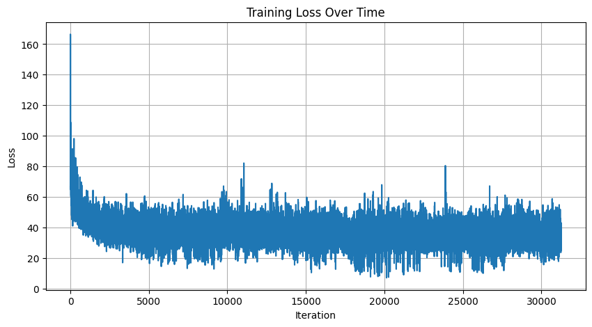
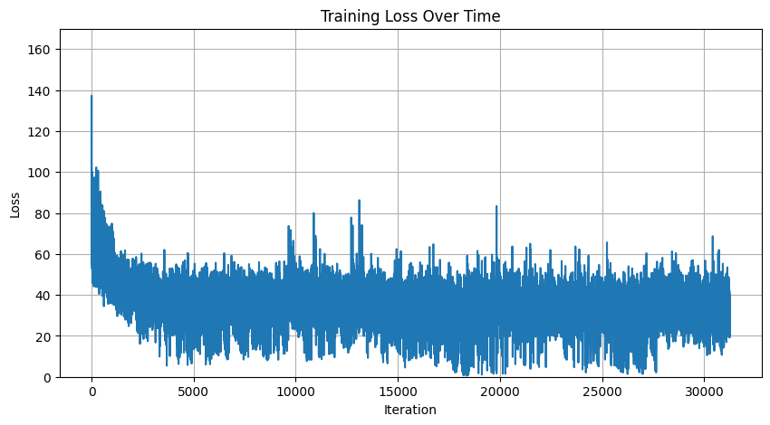

### Simple Pytorch implementation of a vanilla RNN

Pytorch's RNN layer obscures important details of how an RNN works,
while [Karpathy's classic implementation](https://gist.github.com/karpathy/d4dee566867f8291f086) requires some math and backprop to understand. Eli Bendesrky provides an [excellent explanation](https://eli.thegreenplace.net/2018/understanding-how-to-implement-a-character-based-rnn-language-model/#footnote-reference-4) of the details of the math used in Karpathy's code. He also provides an updated, more well-commented version of Karpathy's original code [here](https://github.com/eliben/deep-learning-samples/blob/master/min-char-rnn/min-char-rnn.py).

My implementation finds a middle ground by depending on Pytorch's autograd capabilities to handle the backprop while retaining the low-level details of how an RNN works. Most of the code is modified from [here](https://gist.github.com/Dvelezs94/dc34d1947ba6d3eb77c0d70328bfe03f).

The RNN is a minimal character-level language model that trains on any given text, in this case some Shakespeare.

### Comparisons

Loss for Karpathy's implementation:

Loss for my implementation:

